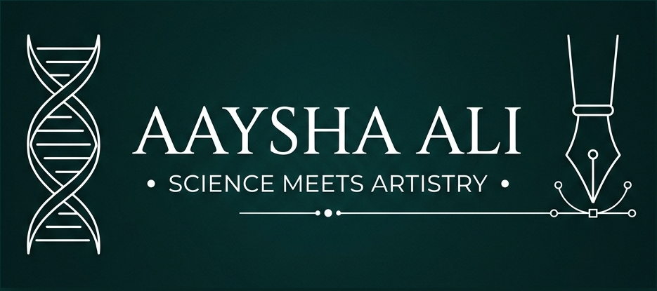

  

  # Aaysha Ali
  ### *"Science meets Artistry"*

  
  
  
  

---

### 🧬 Professional Summary

I am a detail-oriented and research-driven **Bachelor of Pharmacy (B.Pharm)** student at **Jamia Hamdard** with a strong foundation in pharmaceutical sciences, clinical research guidelines, and computational chemistry tools.

I bridge the gap between clinical research and digital informatics—combining hands-on laboratory experience with molecular modeling (docking) and scientific writing. I am committed to translating complex clinical data and traditional pharmacological knowledge into precise, actionable insights.

---

### 🎓 Education & Key Milestones

* 🏫 **Bachelor of Pharmacy (B.Pharm)** | Jamia Hamdard, New Delhi (Aug 2024 – Present)
* 🏆 **Smile Foundation Scholar** | Awarded merit-cum-need academic scholarship, maintained via continuous semester distinctions.
* 📢 **Poster Presenter** | Presented review-based research at the **12th SFE-India International Convention (SECON 2025)** at Jamia Hamdard.

---

### 🔬 Capabilities & Technical Skills

* 🧪 **Laboratory & Computational Chemistry:** HPLC Sample Preparation, Molecular Docking (AutoDock/Vina), Interaction Visualization (PyMOL, Discovery Studio Visualizer), UV-Vis Spectroscopy.
* 📋 **Research & Clinical Trial Methodology:** Good Clinical Practice (GCP) guidelines (NIDA Certified), clinical trial compliance, literature synthesis.
* 💻 **Software & Reference Managers:** Mendeley Reference Manager, ChemDraw, GraphPad Prism, Python (Data Analysis), Canva.
* 🗣️ **Languages:** English (Fluent), Hindi (Proficient), Urdu (Native).

---

### 📂 Featured Repositories

* 📄 [**Resume Repository**](https://github.com/aaysha16/Resume) – Authoritative LaTeX source code and GitHub Actions CI/CD compilation pipeline for my professional CV.
* 🎓 [**Certifications Portfolio**](https://github.com/aaysha16/Certificates) – Digital archive of my verified credentials, laboratory trainings, and conference participation.
* 🌐 [**Portfolio Website**](https://github.com/aaysha16/aaysha16.github.io) – Source code for my personal website.

---

### 🤝 Leadership & Volunteering

* 💻 **Event Volunteer** | Spark Tech AI Hub *Snow Frost Hackathon* (January 2026) – Operational support and participant check-in logistics.
* 🌳 **Sustainability Participant** | Cosmo Foundation & BSF *Miyawaki Forest Plantation Drive* (October 2024) – Biodiversity restoration.
* 💊 **Committee Volunteer** | SPER, Jamia Hamdard *World Pharmacists Day Celebration* (September 2024) – Health outreach coordinator.

---

### ✉️ Connect with Me

* 📧 **Email:** [aliaaysha27@gmail.com](mailto:aliaaysha27@gmail.com)
* 💼 **LinkedIn:** [/in/aayshaali](https://linkedin.com/in/aayshaali)
* 🔬 **ORCID ID:** [0009-0005-5832-6542](https://orcid.org/0009-0005-5832-6542)

---

  

