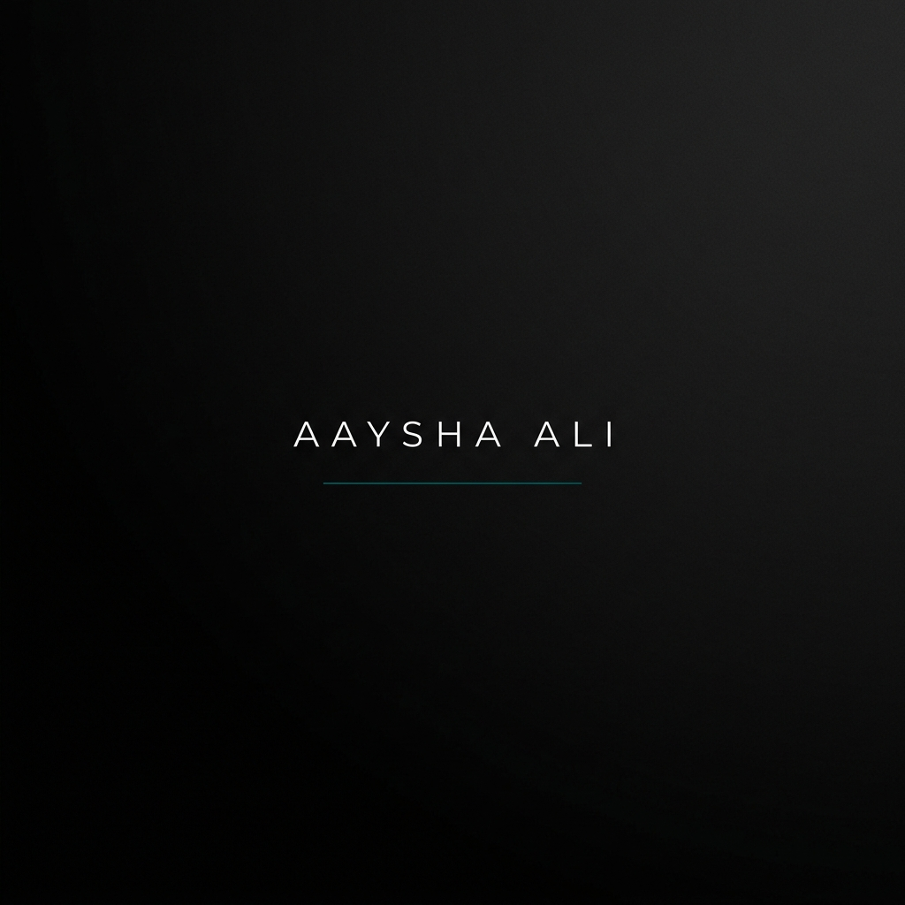

  

  # 💊 Aaysha Ali 🖋️
  ### "Science meets Artistry"

  
  
  
  

---

### 🧬 The Observer & The Researcher
I am a methodical and research-oriented **Bachelor of Pharmacy** undergraduate at **Jamia Hamdard**, New Delhi. My journey is defined by a dual passion: the rigorous, evidence-based approach of clinical research and the expansive, interpretative nature of informatics and writing.

- 🔭 **Focus:** Deep-diving into Pharmaceutical Sciences and Clinical Informatics.
- 🎓 **Achievement:** Merit-cum-Need Based Scholar (Smile Foundation) with a record of Academic Distinction.
- 🎤 **Presence:** Conference Poster Presenter at SECON 2025 (International Academic Conference).
- 🖋️ **Creative Side:** Balancing scientific rigor with Poetry, Reflective Writing, and Culinary Arts.

---

### 🧪 Professional Spectrum

<table align="center">
  <tr>
    <td width="50%" valign="top">
      <h4>🔬 Science & Clinical</h4>
      <ul>
        <li>Clinical Research & Ethics</li>
        <li>Drug Formulation Principles</li>
        <li>Literature Review & Synthesis</li>
        <li>Data Interpretation</li>
      </ul>
    </td>
    <td width="50%" valign="top">
      <h4>💻 Digital & Creative</h4>
      <ul>
        <li>Clinical Informatics</li>
        <li>Medical Writing & Academic Writing</li>
        <li>Visual Communication (Canva/PPT)</li>
        <li>Scientific & Reflective Reading</li>
      </ul>
    </td>
  </tr>
</table>

---

### 🍵 Current Vibes

  

    <b>Reading:</b> <i>"The Emperor of All Maladies"</i> by Siddhartha Mukherjee | <b>Writing:</b> Reflections on SECON 2025 | <b>Exploring:</b> AI in Drug Discovery
  

  

    🎨 <i>Blending the precision of a pipette with the fluidity of a poem.</i> 🧬
  

---

---

### 🖋️ "Science is the poetry of reality."
> *I thrive in environments that require deep critical thinking, keen observation, and the ability to translate complex technical material into clear, impactful insights.*

---

### 📊 GitHub Insights

  
  

  

---

  

